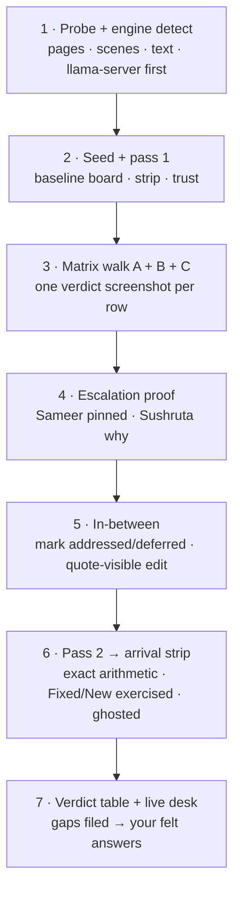

# gun_pen.pdf — Full Feedback-Projection Audit (final)

> **TRACKER -- updated 2026-09-19.** This block is authoritative and is written against the
> CURRENT code, not against the plan's intent. The plan text below it is the original of
> 2026-09-18, kept as history; where the two disagree, this block wins.
>
> **Suite:** 1094 passed / 0 failed -- **Audit artifact:** `impl-shots/audit_results.json`,
> `gaps: []` -- **Stages re-run this session:** `matrix` 18 passed / 0 failed, `pass2` 9 passed /
> 0 failed -- **Stages NOT re-run (their rows below come from their own earlier runs, stored in
> the artifact):** `escalation`, `inbetween`, `cleanbill` -- **Desk:** live on `:8500`.
>
> Tags: `[code]` source read this session - `[test]` unit test green in the 1094 run -
> `[browser]` asserted in a real browser against the running studio this session - `[stored]`
> recorded in the audit artifact by an earlier run of that stage - `[real-model]` real
> llama-server on `:8080`.

## T1. Stage-by-stage

| stage | state | evidence |
|---|---|---|
| `matrix` | **18 passed / 0 failed / 0 gaps** | `[browser]` re-run this session (`_matrix_verify.log`) |
| `pass2` | **9 passed / 0 failed / 0 gaps** | `[browser]` re-run this session (`_pass2_verify.log`) |
| `escalation` | passed earlier, **not re-run this session** | `[stored]` `sameer_reply`, `sushruta_reply` |
| `inbetween` | passed earlier, **not re-run this session** | `[stored]` `edit`, `status_after_edit`, `intents` |
| `cleanbill` | passed earlier, **not re-run this session** | `[stored]` `clean_bill` |

Run a stage with `E2E_BASE=http://127.0.0.1:8500 python tests/e2e_browser_gun_pen_audit.py <stage>`,
adding `GUNPEN_SKIP_ANALYZE=1` to assert against an analysis already on disk instead of starting a
9-minute real run. A stage that runs RETIRES the gaps it tested (`main()`), so `gaps: []` means no
stage holds a filed gap -- it does NOT mean the other stages were re-measured this session.
## T2. Spine A -- finding-emitting feedback (measured this session)

| row | state | evidence |
|---|---|---|
| dialogue | reached the board | `[browser]` `A/dialogue` |
| theme | reached | `[browser]` `A/theme` |
| character | reached | `[browser]` `A/character` |
| structure | reached | `[browser]` `A/structure` |
| scene_function | reached | `[browser]` `A/scene_function` |
| genre | reached | `[browser]` `A/genre` |
| plot_thread | reached | `[browser]` `A/plot_thread` |
| continuity | reached | `[browser]` `A/continuity` |
| principles | **graceful empty** -- zero findings on this script, which the plan calls verification, not a gap | `[stored]` `row_a: ["principles", false]` |
| setup/payoff | spine renders; dangling entries fold into Plot Economy as the plan predicted | `[browser]` `C: setup/payoff spine renders` |
| ink | **2 pins** this run (`4 of 5` quoted findings are open and scene-anchored) | `[browser]` `A/ink` + `[stored]` `ink` |
| deep-card hygiene: trust chip - `no_quote` flagged never dropped - severity label | all three pass | `[browser]` three `A:` checks |

## T3. Spine B -- report-section feedback

| row | state | evidence |
|---|---|---|
| pacing panel | renders | `[browser]` `B/pacing` |
| character dials panel | **reachable now** -- 15 of 45 dial rows render in the dock, `visible: true` (they used to render only into the dead `#struct-rail`) | `[browser]` `B/character_dials` + `[stored]` `row_b.character_dials` |
| writer's mirror | renders | `[browser]` `B/writer_mirror` |
| coverage block | renders | `[browser]` `B/coverage` |
| genre block | renders, and it IS `coverage.genre` rather than a separate panel -- the plan's own matrix correction says so | `[stored]` `row_b` |

**The three writer questions, per surface:** *what did I get* = the board + mass strip + mass
categories above; *where is the flaw* = scene-anchored cards, ink, ruler dots; *what do I do* = the
fix queue and the escalation route below. All three now have a machine check that fails if the
surface goes quiet.
## T4. Cross-cutting truth states (spine C)

| state | current value | evidence |
|---|---|---|
| quote trust readout | renders in the `N of M verified (P%)` shape | `[browser]` `baseline: trust readout is the ... shape` |
| coverage on the CURRENT report (22 findings) | `still_present 5`, `unknown 17`, `addressed 0` | `[stored]` `findings_total`, `findings_status_summary` |
| the scoreboard that made the audit (36-finding report) | `verified 7 / unverified 27` -- that report no longer exists on disk | `[stored]` `badges` |
| failed categories | **none** -- quiet state is the true state here, and the retry mechanism is credited to existing tests exactly as the plan required | `[browser]` `C: no failed categories`, `C: no inline retry button`; `[stored]` `failed_categories: []` |
| empty pass / clean bill | **synthetic probe used** (`Clean_Bill_Probe`), because no zero-finding row occurs naturally -- the plan's stated contingency | `[stored]` `clean_bill: {"synthetic": true}` |
| desk status line | `22 findings on the desk -- the dock's Evidence lens has the ledger.` | `[browser]` `C: the desk status line agrees with the finding count` |
| mass strip on an unedited script | `22 open of 22 findings` | `[browser]` `C: mass strip reports every finding open` |
| phantom `addressed` on an unedited script | **0** (was 2) | `[browser]` `C: unedited script -> zero phantom 'addressed' findings` |
| arrival arithmetic | **exact vs the server's own diff**, and the four numbers now agree with the board | `[browser]` `pass2`; strip reads `Pass: 22 -> 22 still live - 0 no longer flagged - 0 new` over a 22-row board |
| `report.md` | exists and matches the desk, but is titled after the temp upload name (`source.pdf`) -- cosmetic gap, **still open** | `[stored]` |

## T5. Escalation proof (hypothesis-tested)

| route | verdict | evidence |
|---|---|---|
| **Sameer** from a deep card | ✓ quote pinned, room opens, scene gains the discussed tag, and a real reply streams back with a natural forward beat | `[stored]` `sameer_reply`; `[browser]` `ESC-1` screenshot is in `impl-shots/` but was NOT re-taken this session |
| **Sushruta** "why" on the same finding | ✓ **carries genuine per-finding reasoning** -- names the flaw, explains it, locates Scene 2 and quotes the line. The plan's hypothesis was right; no gap needed filing | `[stored]` `sushruta_reply` |

**Honest caveat:** both replies were produced by the real llama-server, but the escalation stage was
not re-run this session, so these are stored artifacts, not a fresh live assertion.
## T6. Scenario script -- step by step

| step | state | evidence |
|---|---|---|
| **1 Probe** (`gun_pen.pdf`, engine preference) | ✓ real llama-server chosen and recorded; parse done | `[real-model]` the stage runs answered from `:8080` |
| **2 Seed + pass 1** (baseline board, mass strip, trust) | ✓ | `[browser]` baseline checks + `A00-baseline-board.png` |
| **3 Matrix walk A + B + C** | ✓ 18 checks, one verdict per row | `[browser]` this session, `_matrix_verify.log` |
| **4 Escalation both ways** | ✓ proven earlier (T5); not re-run | `[stored]` |
| **5 In-between** (marks + one quote-visible edit) | ✓ the edit applied (`similarity 1.0`), and 3 intents were set (`2 addressed`, `1 deferred`) | `[stored]` `edit`, `intents` |
| **6 Pass 2 -> arrival strip** | ✓ **but the plan's premise here is overtaken** -- see T8 note (b) | `[browser]` `pass2` this session |
| **7 Handoff** (gallery + gaps + live desk) | ✓ desk is live on `:8500`; gallery in `impl-shots/`; gaps now live in the machine-checked artifact, currently empty | `[browser]` |

## T7. DoD + traceability

| DoD bullet | state | where it lives now |
|---|---|---|
| Row -> verdict table delivered | ✓ | `docs/FULL_FEEDBACK_AUDIT_VERDICTS.md` (the A-I table + its score line), **updated this session**: `F2` moved to fixed, `I` re-scoped, GAP-7 marked RESOLVED |
| Arrival-strip arithmetic exact (asserted live) | ✓ **and strengthened** -- the check now requires the strip's four numbers to equal the server's own diff AND, on an unchanged script, to equal the board's row count | `pass2` stage this session |
| Intents survive pass 2 | **partially** -- the ghosted-marks check passes and `test_ghosted_marks_report_writer_intent` pins the behavior, but no marks are on disk right now (the audit's 3 were transient), so survival is not currently demonstrable on gun_pen_2 | `[test]` only |
| Escalation proven live both ways; Sushruta "why" verified or GAP filed | ✓ verified, no gap filed | T5 |
| Critique fixes #1-#8 land | see T8 | -- |
## T8. The draft critique's fixes #1-#8

| # | fix | state |
|---|---|---|
| 1 | **split matrix** (A / B / C spines) | ✓ landed and machine-checked by the `matrix` stage (T2-T4) |
| 2 | **Sushruta hypothesis** (per-finding reasoning, else GAP) | ✓ verified as genuine, no gap filed (T5) |
| 3 | **quote-visible drift** so pass 2 can exercise Fixed/New | ⚠ **premise overtaken.** The audit's edit landed (`similarity 1.0`) -- but it edits the WORKING copy, and the analyzer reads `parsed.json`, so with the GAP-7 gate a force re-analysis after a working-copy edit now correctly reports `same_input=true, fixed=0, new=0`. Fixed/New is therefore reachable only after a RE-PARSE + re-analysis; writer progress is reported by the draft clause, not the pass line. That is the correct division, and it means step 6's original expectation cannot be met by step 5's route |
| 4 / 6 | **honest retry fallback** (quiet state credited to tests if nothing failed live) | ✓ landed: no category failed, and that is stated rather than staged (T4) |
| 5 | **synthetic empty-state only if needed** | ✓ landed: no zero-finding row occurs naturally, so `Clean_Bill_Probe` was used -- exactly the contingency |
| 7 | **one verdict screenshot per row** | ✓ gallery in `impl-shots/`. Caveat: this session's `matrix` / `pass2` re-runs refreshed their own shots only; the `A00/A01/C00/C01/ESC-*` shots still in the tree were modified before this session began and were not re-taken |
| 8 | **engine preference noted** | ✓ real llama-server on `:8080` throughout; the demo model was not used for the verdicts |

## T9. Constraints -- where the plan was deliberately overtaken

- *"No production code changes; gaps -> NOTES.md"* was true of the **audit run**, and it is why the
  audit's value survived: it filed rather than fixed. The FOLLOW-UP wave passes then changed code on
  purpose (GAP-6 and its ink wrap, the desk status line, the dials, the phantom `addressed`, GAP-7 and
  the strip headline). Read this plan as the audit's contract, not the project's.
- **The gap ledger moved.** Gaps now live in the machine-checked artifact
  `impl-shots/audit_results.json` (`gaps`, currently `[]`) as well as in prose in `NOTES.md`; a stage
  that runs retires the gaps it tested. Prose alone is how GAP-6 sat unnoticed for four waves.
- **The authoritative status board is not in this file.** It is the STATUS BOARD at the top of
  `docs/CRITICAL_REVIEW_2026-09-18.md`; this tracker covers only this plan's spine.

## T10. What this tracker does NOT confirm

- `escalation`, `inbetween`, `cleanbill` were **not re-run this session**; their rows are stored
  artifacts (T1). Re-running them is the cheapest way to close that.
- The 26-suite browser sweep ("403 checks / 0 failed") is still a wave write-up, **not** re-run.
- The real-model numbers here are the analysis currently on disk for `gun_pen_2` (22 findings). The
  36-finding report the audit was written against no longer exists, so its `badges` and
  `status_after_edit` values are historical records, not current facts.
- "Intents survive pass 2" rests on a unit test, not a live mark (T7).

## Objective

Take `gun_pen.pdf` through the desk and audit **every feedback type the backend emits**
against the real writer's three questions — *what did I get? where is the flaw? what do I
do?* — plus working escalation: **Sameer** ("what next") and **Sushruta** ("why flagged,
in what way"). Session-only: gaps get **filed, not hotfixed**. Ends with a one-screen
verdict table + the desk left live in your browser.

## The audit spine — split matrix (the draft critique's fix #1)

**A. Finding-emitting feedback** (rides the counting contract: mass strip, Evidence deep
cards, ink, category chips, ruler dots, fix queue):
dialogue · theme · character · structure · scene_function · principles · setup_payoff
(ledger rows + scene spine; dangling entries fold into Plot Economy).
Per row verify: verified quote + trust chip on card · severity shape (never color-alone)
· zero-finding = clean state.

**B. Report-section feedback** (craft panels + blocks):
pacing panel · character dials panel · writer's mirror (char_reads perception + logline
test missing/extra rows) · coverage block (logline + totals) · genre block.
Per row verify: renders from real gun_pen data · readable without findings.

**C. Cross-cutting truth states:**
- Quote trust: "N of M verified (P%)" + per-card chips; not_found/no_quote **flagged, never dropped**.
- Failed categories: dash warn + desk retry + arrival-strip inline retry. If no category
  fails live: quiet-state verified live + retry mechanism credited to existing tests
  (stated honestly, fix #4/#6).
- Empty pass: "clean bill" reading — synthetic mini-project fallback only if no
  zero-finding row occurs naturally (fix #5).
- report.md (the analyzer's readable artifact) — exists, opens, matches the desk's numbers.

## Escalation proof (hypothesis-tested, fix #2)

- **Sameer**: Discuss from deep card + fix queue + loop bar → quote **pinned**
  (`setPendingQuote`), room opens, scene page gains the discussed tag.
- **Sushruta**: the Sushruta lens on the same finding → verify it carries **per-finding
  reasoning** (in what way flagged + why). If it's a generic chat with no finding
  context → **GAP filed** (your requirement, verbatim).
- Both routes preserve manuscript context (no dead-ends).

## Scenario script

1. **Probe** `gun_pen.pdf`: pages, INT/EXT count, text layer (OCR contingency =
   best-effort + low-confidence, stated). Engine: prefer real llama-server
   (`localhost:8080`) if reachable, else demo model — **noted in results** (fix #8).
   Script length honestly recorded (49 KB may be short-form; thin pacing/structure on a
   short script is script-shape reality, not a product gap).
2. **Seed + pass 1** — baseline screenshots: board, mass strip, trust readout.
3. **Matrix walk** — rows A then B then C; the three writer questions answered per row.
4. **Escalation proof both ways.**
5. **In-between** — mark 2–3 addressed, 1–2 deferred, plus **one quote-visible edit**
   (change a line a finding cites) so pass 2 can exercise Fixed/New (fix #3).
6. **Pass 2** — arrival strip **asserted exact** vs computed diff (Last pass · Still live
   · Fixed · New · trust %); ghosted marks honest; unread-dot lifecycle.
7. **Handoff** — one verdict screenshot per row (fix #7), gallery in `impl-shots/`,
   gaps filed in NOTES.md, desk left live at the gun_pen project; the felt checklist
   (`docs/REAL_WRITER_VALIDATION.md`) stays yours, now answerable per surface.

## Constraints

- No production code changes; gaps → NOTES.md for a follow-up tuning go.
- A category producing no findings on this script = graceful-state verification, not a gap.
- Engine realism noted wherever findings depth matters.

## DoD + traceability

- **Row → verdict table delivered in the final response** (projected ✓ / graceful ✓ /
  escalation ✓ / GAP filed) — the audit's one-screen artifact.
- Arrival-strip arithmetic exact (asserted live); intents survive pass 2.
- Escalation proven live both ways; Sushruta "why" verified or GAP filed.
- Critique fixes #1–#8 all land in the steps above (matrix split · Sushruta hypothesis ·
  quote-visible drift · honest retry fallback · synthetic empty-state only if needed ·
  one-shot-per-row gallery · verdict table · engine preference).